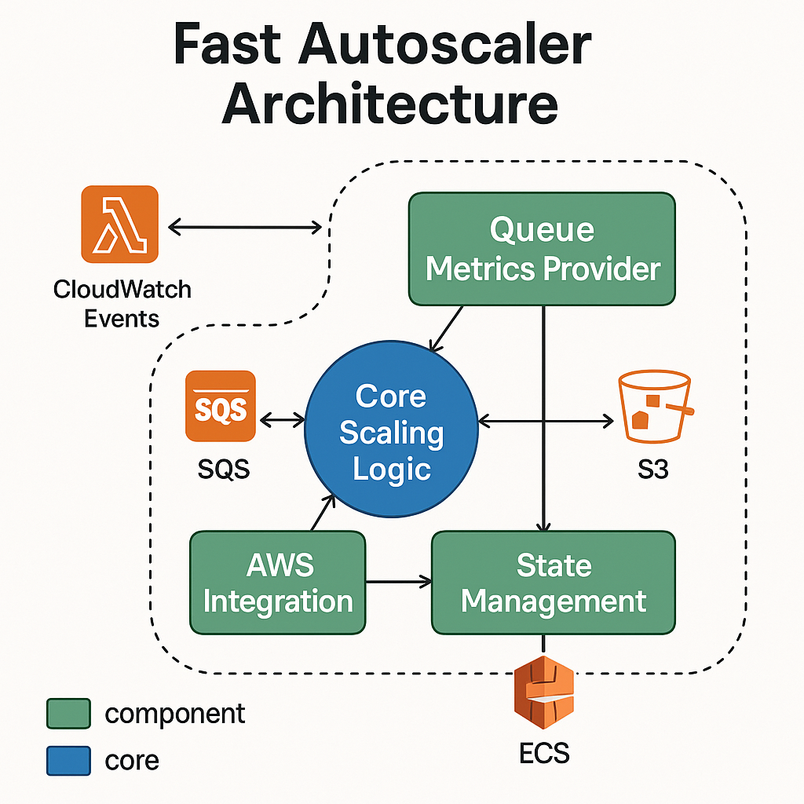

# Architecture

Fast Autoscaler follows a modular architecture design that separates concerns and enables extensibility.

## High-Level Components



The Fast Autoscaler consists of these main components:

1. **Lambda Function (Entry Point)**: Triggered on a schedule, coordinates the scaling process
2. **Queue Metrics Provider**: Abstraction for retrieving message counts from different queue providers
3. **Scaling Logic**: Core algorithm that determines the appropriate scaling action
4. **State Management**: Tracks scaling events and manages cooldown periods
5. **AWS Integration**: Lightweight wrapper around AWS services

## Component Interactions

1. The Lambda function is triggered by CloudWatch Events (typically every minute)
2. Queue metrics are retrieved from the configured provider (e.g., SQS)
3. Current ECS service state is retrieved (current task count)
4. Scaling logic determines if adjustment is needed based on metrics and configuration
5. If scaling is required and not in cooldown, the ECS service is updated
6. Scaling state is stored in S3 for future reference and cooldown management

## Directory Structure

```
autoscaler/
├── __init__.py
├── main.py                 # Lambda handler and entry point
├── scaler.py               # Core scaling logic
├── queue_metrics/          # Queue metrics providers
│   ├── __init__.py
│   ├── sqs.py              # SQS implementation 
│   └── amq.py              # Future AMQ support
├── state/                  # State management
│   ├── __init__.py
│   └── s3_state.py         # S3-based state tracking
└── aws/                    # AWS integration
    ├── __init__.py
    └── wrapper.py          # AWS service wrapper
```

## Extensibility

This architecture makes it easy to:

1. Add support for new queue providers (just add a new implementation in the queue_metrics package)
2. Modify scaling logic independently of metrics collection
3. Change state storage mechanisms if needed
4. Support different AWS resource types for scaling (beyond ECS)